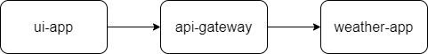

# Distributed Session Cookie Authentication using Spring Session Redis
## Proof of Concept

### Requirements
* Java 20
* Docker compose 3

### Architecture



### 1. Build the project
```console
gradlew.bat clean build
```
### 2. Run docker compose
```console
docker-compose up
```

### 3. Run each subproject
```console
gradlew.bat :ui-app:bootRun
```
```console
gradlew.bat :api-gateway:bootRun
```
```console
gradlew.bat :weather-app:bootRun
```

### 4. Expected result
* UI application will start at localhost:8080
* Redis dashboard will start at localhost:8888


* Visit localhost:8080
* Try to open secured page
```console
login: user
password: password
```
After login you should see the content of the secured page \
If you go straight to the secured api, it will pass you because browser has the session cookie
```console
http://localhost:8082/current-la-weather
```

But if you go into redis dashboard, remove the cookie and try to open the page one more time, it will return 403 as expected

### 5. Stop applications and docker
```console
docker-compose down
```
